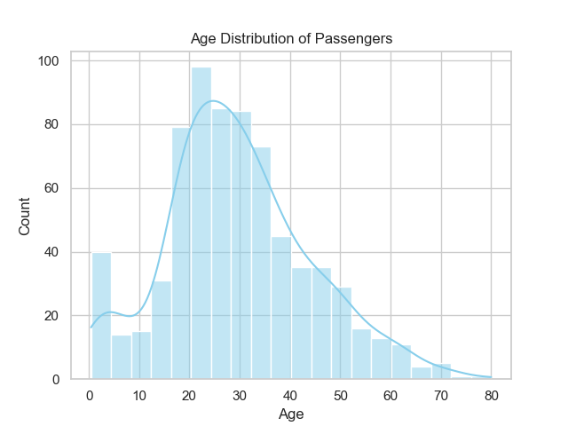
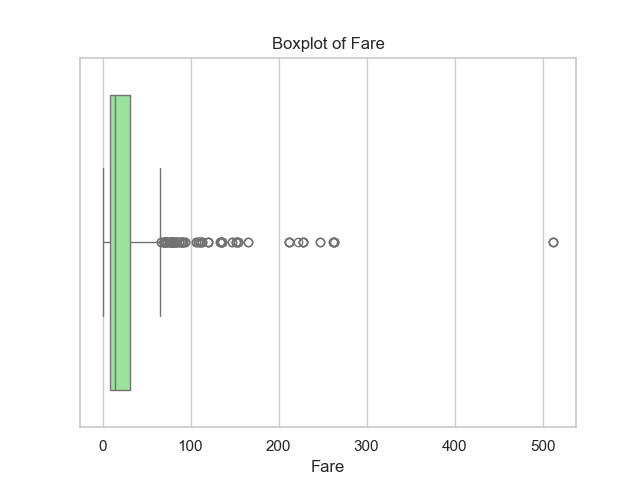
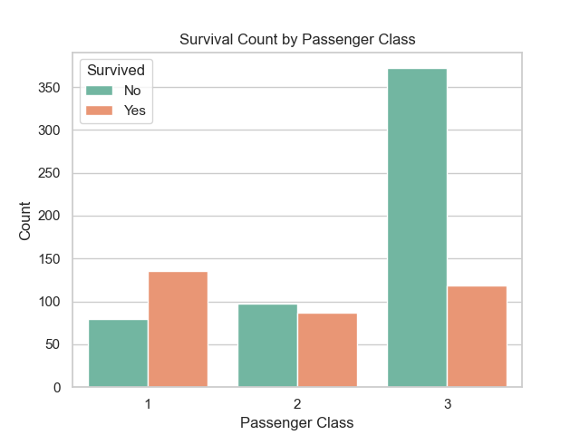
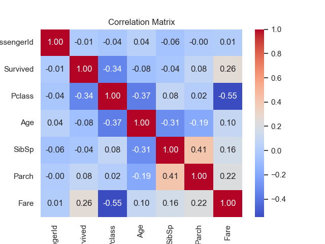
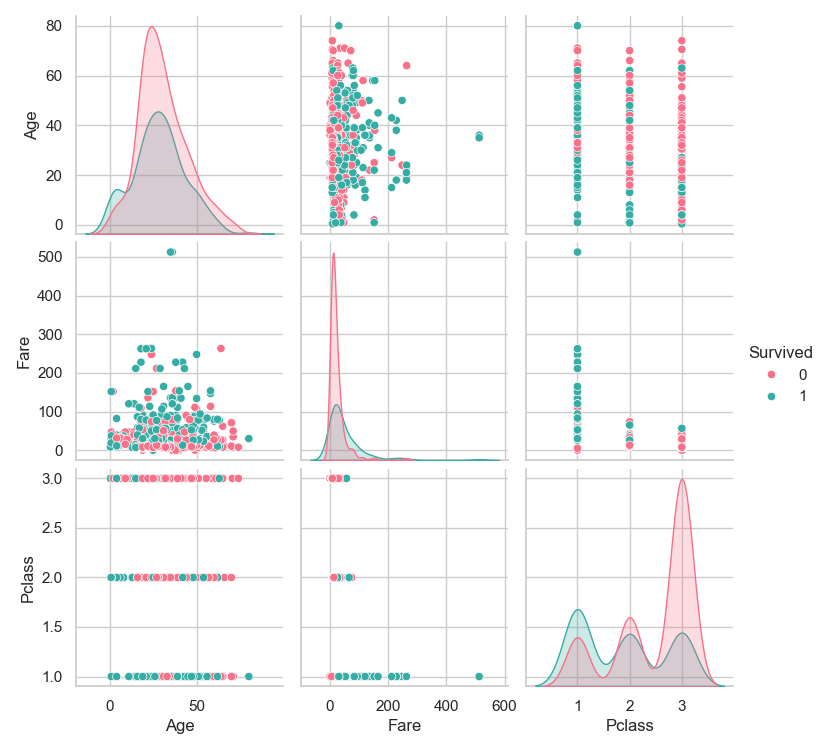

# 🚢 Task 2: Exploratory Data Analysis (EDA) – Titanic Dataset

## 📌 Objective
To explore and analyze the Titanic dataset using statistics and visualizations, and uncover patterns or relationships between features that can help in further ML modeling.

---

## 🛠️ Tools Used

- **Python**  
- **Pandas**  
- **Matplotlib**  
- **Seaborn**

---

## 📊 EDA Process

### 1. Summary Statistics
- Used `.describe()` to generate mean, median, std, min, max, etc.
- Helps understand distribution and data types at a glance.

### 2. Visualizations Created

#### 📈 Age Distribution
Shows most passengers were young adults.


#### 💵 Fare Boxplot
Reveals outliers—some fares were extremely high.


#### 🎫 Survival by Passenger Class
Passengers in 1st class had higher survival rates.


#### 🔥 Correlation Heatmap
Shows how features relate to each other—`Pclass` and `Fare` are notably linked to `Survived`.


#### 🔍 Pairplot of Key Features
Combines multiple relationships visually.


---

## 🔍 Key Insights

- **Survival is correlated with `Fare` and `Pclass`**.
- **Younger passengers** were more frequent, but age didn’t strongly predict survival alone.
- **Class mattered a lot**—1st class passengers had a much higher survival rate.
- **Outliers** were present in the `Fare` feature, confirmed by the boxplot.

---

## 📁 Repository Contents

| File/Folder              | Description                                     |
|--------------------------|-------------------------------------------------|
| `Titanic-Dataset.csv`    | The raw dataset used                           |
| `task2_eda_analysis.py`  | Python script performing the entire EDA        |
| `eda_outputs/`           | All generated visualizations (PNG format)      |
| `README.md`              | Documentation of task and analysis             |

---

## ▶️ How to Run

```bash
pip install pandas seaborn matplotlib
python task2_eda_analysis.py
